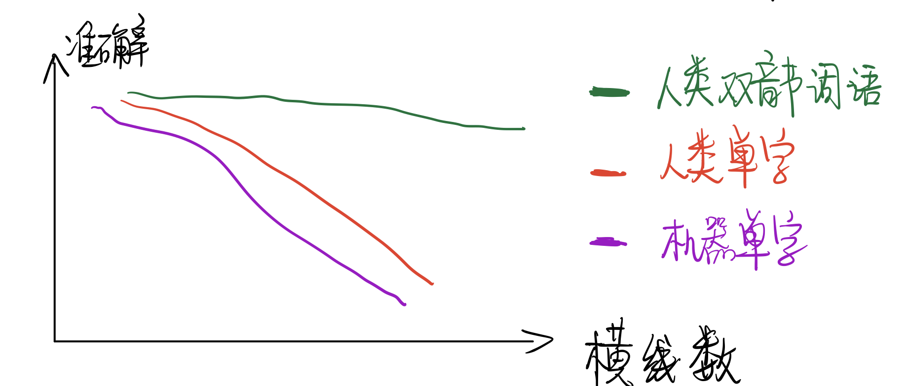

# 大创

## 1. 假设和实验设计

**假设一**：增加图像的干扰（本课题以横竖线为例），人类和机器的单个字识别率降低。

实验设计：

- 训练集：单个汉字+20条横线
- 模型：ResNet
- 测试集：1）单个汉字+20条横线；2）单个汉字+40条横线；3）单个汉字+60条横线

实验预期：随着横线增多，模型准确率降低，人类的准确率也降低。

附加实验：在“单个汉字+60条横线”上训练，在”单个汉字+20条横线“上测试，准确率如何变化？

**假设二**：增加图像的干扰，但是引入双音节词语，人类的准确率不变化

实验设计：让人类做1）双音节词语+20条横线；2）双音节词语+40条横线；3）双音节词语+60条横线

实验预期：1）随着横线增多，人类的准确率几乎不变化；或者，相对于假设一的人类准确率下降曲线更平缓一些

**假设三**：图像识别模型(VM)引入语言模型(LM)后，准确率上升

实验设计：

- 训练集：双音节汉字+20条横线
- 模型：ResNet + BERT
- 测试集：1）双音节汉字+20条横线；2）双音节汉字+40条横线；3）双音节汉字+60条横线

实验预期：同假设三

## 2. 最终模型设计

### 2.1 基于搜索

**假设四**：对于错误的汉字分类，正确汉字的score应该在前5

设计实验：**‼️跟假设一的实验一起做**

- 除了计算准确率外，可以引入top-k正确率，只要答案在前k个，就算分类正确

实验预期：找到合适的k，使得top-k正确率上升，跟“人类双音节词语”曲线差不多

**如果假设四成立，那么可以使用搜索的方法**：

例如输入图片写着“王位”，那么输出$y_1\in\{王, 丰, 玉\},y_2\in\{位, 伫, 立\}$

结合语言模型，我们的目标函数是
$$
\underset{y_1, y_2}{\mathrm{argmax}}\ \ p(y_1, y_2)
$$
等价于
$$
\begin{align*}
  p(y_1, y_2) &= \frac{1}{2}(p(y_1, y_2)+p(y_1, y_2)) \\
    		  &= \frac{1}{2}(p(y_1|y_2)p(y_2)+p(y_2|y_1)p(y_1)) \\
\end{align*}
$$
其中，

$p(y_1)$和$p(y_2)$为先验分布，来自ResNet的结果，可用score代替

$p(y_1|y_2)$和$p(y_2|y_1)$为后验分布，来自BERT，可用MASK分类的score代替

**注意**：BERT在这个方法中是不用fine-tune的

### 2.2 基于Embedding

例如输入图片写着“王位”，那么输出$y_1\in \mathbb{R}^d,y_2\in \mathbb{R}^d$

讲$y_1$和$y_2$两个embedding送入BERT中，输出$z_1\in \mathbb{R}^d,z_2\in \mathbb{R}^d$

‼️没想好

## 3. Reference

- [Towards Accurate Scene Text Recognition with Semantic Reasoning Networks](https://arxiv.org/pdf/2003.12294.pdf)
- 